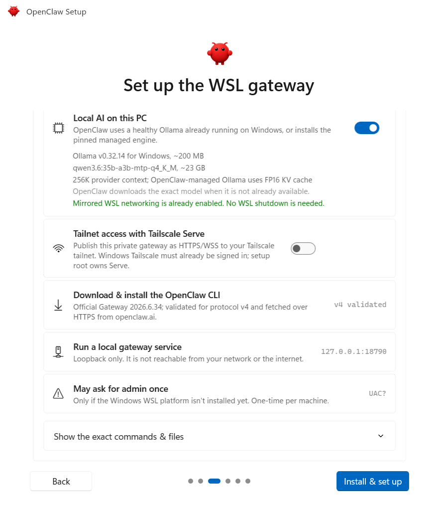
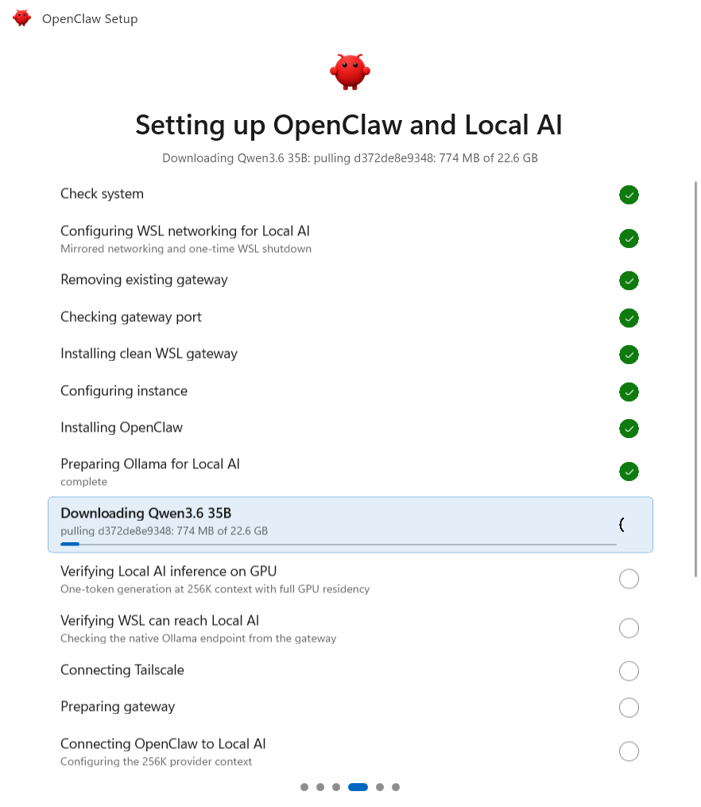
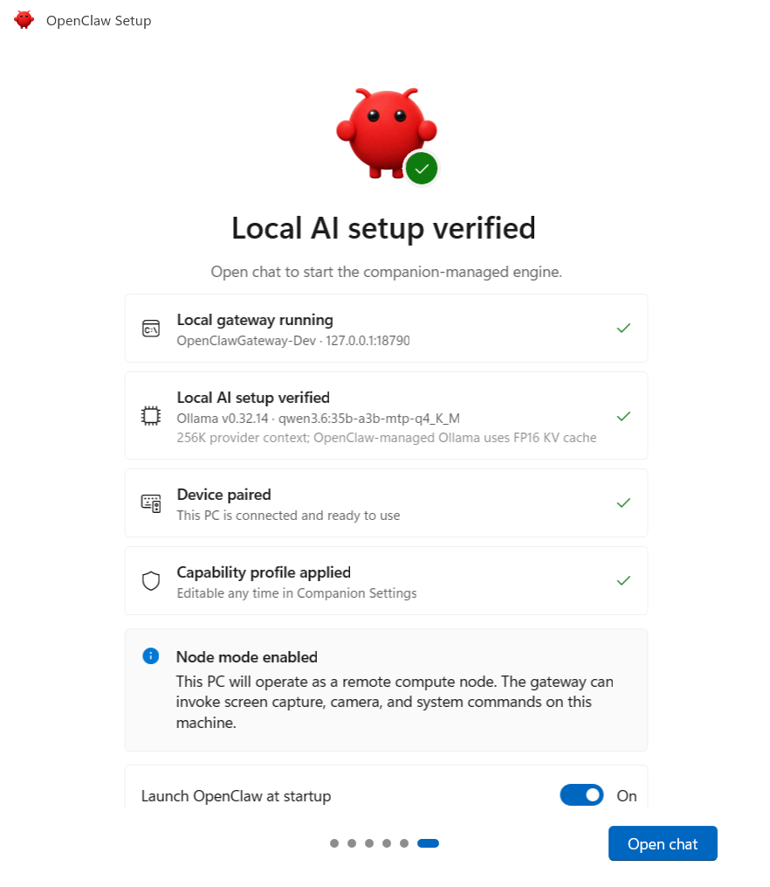
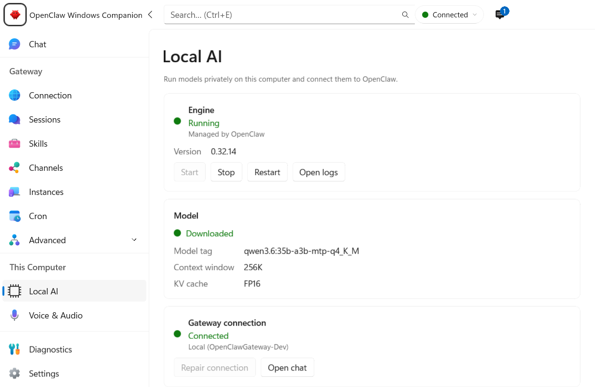
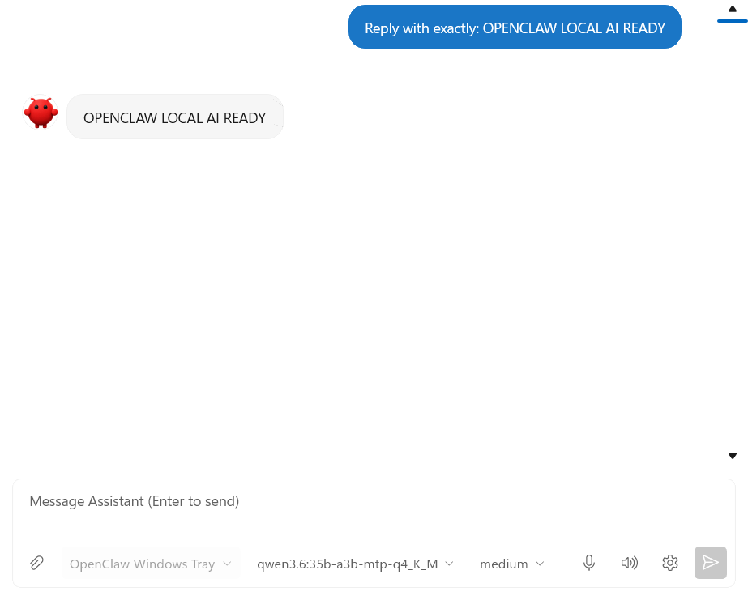

# Local AI with companion-managed Ollama on Windows

Status: passed. The end-to-end functional flow, companion-owned lifecycle, orderly shutdown, focused validation, and required broad validation are proven.

## Outcome

OpenClaw successfully:

1. Qualified the NVIDIA GPU.
2. Installed native Windows ARM64 Ollama 0.32.14.
3. Re-downloaded the exact model into an isolated companion-managed store.
4. Loaded the model at a 262,144-token context with FP16 KV cache and all 42 layers on CUDA.
5. Reached native Ollama from the WSL gateway over mirrored loopback.
6. Configured Ollama as the OpenClaw primary model provider.
7. Completed primary chat with the exact response `OPENCLAW LOCAL AI READY`.
8. Demonstrated direct Windows companion ownership of the native Ollama listener after the lifecycle fixes, followed by an orderly exit with no orphaned processes or listener.

The inference path is:

```text
OpenClaw chat
  -> OpenClaw Gateway in WSL
  -> http://127.0.0.1:11434 through mirrored networking
  -> companion-managed native Windows Ollama
  -> llama-server using CUDA v13
```

Inference does not use OpenClaw node delegation. The Windows node remains enabled for Windows capabilities, while primary chat uses the normal Ollama provider path.

## Run identity

- Onboarding and benchmark revision: `db8ec612`
- Final runtime and screenshot revision: `f2829b77`
- Lifecycle fixes present in the proof-bundle base: `0bafcf78`, `b92e29b7`, and `f2829b77`
- Broad validation revision: `f56a16f3`, code-equivalent to primary `f2829b77` after cherry-picking the same fixes under different SHAs
- OpenClaw Gateway: 2026.6.34 (`5c38f99`)
- Ollama: 0.32.14, Windows ARM64
- NVIDIA driver: 616.00
- GPU: NVIDIA RTX Spark N1X, 24,512 MiB NVML GPU pool
- Model: `qwen3.6:35b-a3b-mtp-q4_K_M`
- Context: 262,144 tokens
- KV cache: FP16
- Backend: `cuda_v13`
- Flash attention: enabled
- Parallel requests: 1
- Maximum loaded models: 1

The visual-only `1e39a07b` change corrected the proof-capture background. It did not alter inference or provider behavior.

## Before and after UX proof

The onboarding review names the exact engine, model, context, and KV-cache policy before installation:



The companion then performs the real model download into its isolated model store:



Setup reports the gateway and Local AI verification results:



After restart, the Local AI page shows the native engine running and managed by OpenClaw:



Primary chat returns the requested exact response:



## Acquisition and connection evidence

The setup pipeline completed successfully in 882.1 seconds.

| Step | Result | Duration |
|---|---:|---:|
| NVIDIA hardware qualification | 24,512 MiB qualified | 15 ms |
| Install managed Ollama 0.32.14 | Success | 11.8 s |
| Download exact Qwen model | Success | 698.3 s |
| Verify generation and GPU residency | Success | 27.5 s |
| Verify Ollama from WSL | Success | 9.2 s |
| Configure Gateway Ollama provider | Success | 5.3 s |

The verifier reported generation with the exact model at 262,144 context and 22,857,174,219 bytes resident on GPU. WSL independently reached Ollama 0.32.14 and verified the exact model tag, digest, and size. The Gateway configuration step then selected the Ollama provider as primary.

Before setup, the exact global model manifest and its two large blobs had been removed. The companion created a separate model store under its isolated Local AI root and downloaded new blobs there. The different global tag `qwen3.6:35b` was intentionally preserved.

## Exact model size

| Component | Bytes | Decimal GB | GiB |
|---|---:|---:|---:|
| Main Q4 model layer | 21,718,480,960 | 21.718 | 20.227 |
| MTP/projector layer | 902,821,728 | 0.903 | 0.841 |
| Main model plus projector payload | 22,621,302,688 | 22.621 | 21.068 |
| Ollama API size, including metadata | 22,621,314,717 | 22.621 | 21.068 |
| Loaded size reported by `/api/ps` | 22,857,174,219 | 22.857 | 21.287 |

Exact manifest digest:

```text
c7bd058dd9774cae7dae32ef8cf3822aaacddd21e635e3cb6ec38effca0dc57f
```

## Process ownership and shutdown

The final clean-cycle snapshot at revision `f2829b77` showed:

```text
OpenClaw.Tray.WinUI.exe  PID 6692
  -> ollama.exe          PID 6672

127.0.0.1:11434         owned by PID 6672
```

The Ollama executable came from the isolated companion Local AI root. Native Windows and WSL requests both returned Ollama 0.32.14. Both paths returned the exact tag with size 22,621,314,717 bytes and digest `c7bd058dd9774cae7dae32ef8cf3822aaacddd21e635e3cb6ec38effca0dc57f`.

After orderly companion exit, the companion PID, Ollama PID, and TCP listener were all absent. This proves direct parent-child ownership, loopback-only serving, and cleanup at the final revision. During the benchmark, the managed `llama-server.exe` runner was PID 28172 and loaded the model from the same isolated root.

## GPU fit and memory

The model initialized a 262,144-token context successfully. Runtime evidence showed:

- 42 of 42 model layers offloaded to CUDA.
- Main model buffer: 20,428.12 MiB CUDA plus 272.81 MiB CUDA-host.
- Target-model FP16 KV cache: 5,120 MiB.
- MTP draft FP16 KV cache: 512 MiB.
- Flash attention enabled.
- `/api/ps` `size` and `size_vram` both 22,857,174,219 bytes, or 100% Ollama-reported model residency.

Loaded-state memory snapshot:

| Counter | MiB |
|---|---:|
| NVML GPU pool total | 24,512 |
| NVML used | 24,390 |
| NVML free | 109 |
| llama-server WDDM dedicated | 23,833.1 |
| llama-server WDDM shared | 5,524.0 |
| Adapter WDDM dedicated | 24,406.7 |
| Adapter WDDM shared | 5,899.3 |
| Installed physical memory | 65,536 |
| Windows-visible physical memory | 38,988.7 |
| Hardware-reserved/carveout indicator | 26,547.3 |

Conclusion: the model fits and runs fully layer-offloaded at the configured 256K context. The complete runtime allocation is not confined to the 24.5 GiB dedicated pool, because WDDM reports about 5.5 GiB of shared UMA allocation for the runner. `size_vram == size` proves Ollama-reported model residency, not that KV and scratch allocations are all dedicated.

## Primary chat proof

The companion selected the exact model for the OpenClaw session. The Gateway issued `POST /api/chat`, which returned HTTP 200 in 35.018 seconds. The first request contained 23,041 prompt tokens and produced 7 output tokens. OpenClaw recorded a final 23-character assistant response, and the screenshot visibly confirms the exact text:

```text
OPENCLAW LOCAL AI READY
```

## Performance

The complete machine-readable result is [managed-qwen36-35b-q4-f16-262k.json](managed-qwen36-35b-q4-f16-262k.json). Its SHA-256 is:

```text
7ab09ea189556bda00a4dbc642e081b4044748d9d49c35aae6b5686a0da69f4c
```

Benchmark settings were 262,144 context, FP16 KV, `num_gpu=999`, batch 512, about 3,660 prompt tokens, and 36 output tokens per run.

| Run | TTFT | Model load | Prompt tok/s | Decode tok/s | Wall time |
|---|---:|---:|---:|---:|---:|
| Unloaded-runner sample | 47.163 s | 44.180 s | 1,251.94 | 34.64 | 48.214 s |
| Hot 1 | 2.992 s | 0.527 s | 1,581.93 | 44.76 | 3.813 s |
| Hot 2 | 2.900 s | 0.509 s | 1,617.33 | 52.42 | 3.601 s |
| Hot 3 | 2.946 s | 0.480 s | 1,556.12 | 50.14 | 3.679 s |
| Hot median | 2.946 s | 0.509 s | 1,581.93 | 50.14 | 3.679 s |

### Cold-result caveat

The 47.163-second result is model-unloaded or reload-cold, not reboot-cold:

- The Ollama daemon was already running.
- No `llama-server` process was loaded at the measured baseline.
- Baseline NVML use was 584 MiB.
- Windows had been running for about 15.5 hours.
- The NVIDIA ComputeCache already contained 199,767,220 bytes.
- The run read about 6.59 GB from physical disk, less than the 22.62 GB model payload.

A strict reboot-cold claim requires rebooting and repeating the benchmark before any model access. The hot decode median is based on three short, 36-output-token samples, so it is an acceptance measurement rather than a broad performance characterization.

## Reproduction commands

These commands expose only process, model, and performance metadata. They do not read gateway credentials or raw configuration.

```powershell
$runRoot = "$env:USERPROFILE\OpenClaw-Ollama-Experience\managed-acceptance-db8ec612"

Invoke-RestMethod http://127.0.0.1:11434/api/version

$tags = Invoke-RestMethod http://127.0.0.1:11434/api/tags
$tags.models |
  Where-Object name -eq 'qwen3.6:35b-a3b-mtp-q4_K_M' |
  Select-Object name, size, digest

$ps = Invoke-RestMethod http://127.0.0.1:11434/api/ps
$ps.models |
  Where-Object name -eq 'qwen3.6:35b-a3b-mtp-q4_K_M' |
  Select-Object name, size, size_vram, context_length

wsl.exe -d OpenClawGateway-Dev -u openclaw -- `
  curl -fsS http://127.0.0.1:11434/api/version

wsl.exe -d OpenClawGateway-Dev -u openclaw -- `
  curl -fsS http://127.0.0.1:11434/api/tags

Get-CimInstance Win32_Process |
  Where-Object {
    $_.Name -in @('OpenClaw.Tray.WinUI.exe', 'ollama.exe', 'llama-server.exe')
  } |
  Select-Object ProcessId, ParentProcessId, Name, ExecutablePath

Get-NetTCPConnection -State Listen -LocalPort 11434 |
  Select-Object LocalAddress, LocalPort, OwningProcess

python "$env:USERPROFILE\OpenClaw-Ollama-Experience\benchmark_q4_mtp_context.py" `
  --model qwen3.6:35b-a3b-mtp-q4_K_M `
  --kv-cache-type f16 `
  --contexts 262144 `
  --hot-runs 3 `
  --output "$runRoot\managed-qwen36-35b-q4-f16-262k.json"
```

Required repository validation:

```powershell
$env:OPENCLAW_REPO_ROOT = (Get-Location).Path
powershell.exe -NoProfile -ExecutionPolicy Bypass -File .\build.ps1
dotnet test .\tests\OpenClaw.Shared.Tests\OpenClaw.Shared.Tests.csproj --no-restore
dotnet test .\tests\OpenClaw.Tray.Tests\OpenClaw.Tray.Tests.csproj --no-restore
dotnet test .\tests\OpenClaw.SetupEngine.Tests\OpenClaw.SetupEngine.Tests.csproj --no-restore
dotnet test .\tests\OpenClaw.Connection.Tests\OpenClaw.Connection.Tests.csproj --no-restore
```

Final results:

| Validation | Passed | Skipped | Failed |
|---|---:|---:|---:|
| `build.ps1` | 5 projects plus the then-current 46 documentation files | 0 | 0 |
| Final proof-worktree documentation validation | 47 files | 0 | 0 |
| Shared tests | 3,698 | 32 | 0 |
| Tray tests | 2,579 | 0 | 0 |
| SetupEngine tests | 971 | 0 | 0 |
| Connection tests | 660 | 0 | 0 |

The build reported no warnings or errors. Validation ran at `f56a16f3`, which is code-equivalent to primary `f2829b77`; the lifecycle-fix cherry-picks have different SHAs but identical code. After adding this proof README, `scripts/validate-docs.ps1` passed all 47 Markdown files in the proof worktree.

One broad-validation invocation reached a 120-second harness cutoff. In the fresh worktree, the first Shared and SetupEngine `--no-restore` invocations also lacked restored assets. The tests were restored and rerun, and the complete results above passed.

Focused validation also passed:

- Runtime lifecycle tests: 15 passed.
- Full Connection suite: 660 passed.
- Screenshot-capture regression: 1 passed, followed by a successful ARM64 Setup UI build.
- Health-dispatch regression: 1 passed.

## Final lifecycle revalidation: passed

The initial acceptance run exposed three shutdown issues that were fixed before final validation:

- `OllamaRuntimeService.OnManagedProcessExited` could access a disposed `SemaphoreSlim`.
- The debug screenshot listener could cancel a disposed `CancellationTokenSource`.
- The health monitor could write `AppState.LastCheckTime` away from the UI thread.

The post-fix clean-cycle log marker was recorded at `2026-08-18 08:56:26 -07:00`, line 1634. The following 186 new lines covered startup, runtime verification, and orderly exit:

```text
Final revision:                         f2829b77
Companion PID:                          6692
Direct child managed Ollama PID:        6672
127.0.0.1:11434 listener owner:         6672
Native /api/version:                    0.32.14
WSL /api/version:                       0.32.14
Exact model size and digest:            verified from native and WSL
ERROR lines:                            0
WARN lines:                             4
ObjectDisposedException:                0
CancellationTokenSource disposed:       0
LastCheckTime UI-thread warning:         0
UnobservedTaskException:                 0
UnhandledException:                     0
Post-exit companion/Ollama/listener:     absent
```

The four warnings were expected and non-fatal: two hotkey conflicts because the production tray remained open, one initial `models.list` handshake retry, and one Gateway reconnect retry. The exit sequence completed normally. An earlier clean cycle also passed.

Raw application logs, configuration, device identities, and credentials are intentionally excluded from this proof bundle.
